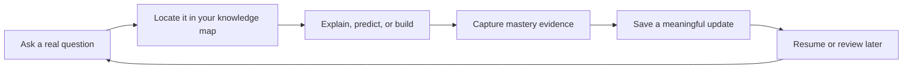
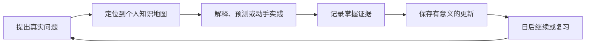

<div align="center">

# Learning Coach

**Turn scattered AI conversations into a personal knowledge tree that remembers what you have mastered, reveals what is missing, and guides the next useful step.**

[English](#english) | [简体中文](#简体中文)

[](LICENSE)
[](https://github.com/SShending/learning-coach/issues/15)
[](skills/learning-coach/references/vault-format.md)
[](#quick-start)

</div>

---

<a id="english"></a>

## English

### Learn beyond the current chat

Most AI tutors answer the question in front of them. When the chat ends, your
learning state disappears with it.

Learning Coach turns your questions, explanations, mistakes, reviews, and
working code into a durable personal knowledge map. It resumes from evidence,
not from a vague claim that you "understand."

> Your AI tutor should remember how you learn, not just what you asked.

| What it does | What you gain |
| --- | --- |
| Maps each question to concepts and prerequisites | See the gaps behind the question |
| Tracks mastery from explanations, predictions, and working results | Know what you can actually use |
| Carries focus, evidence, misconceptions, and next steps across chats | Continue instead of restarting |
| Builds a review queue from weak or aging evidence | Revisit the right thing at the right time |
| Stores distilled state in your private GitHub repository | Own, inspect, and version your learning history |

### The learning loop



Learning Coach saves only durable changes. It does not turn every conversation
into a transcript or every answer into a note.

### Quick start

1. Create an empty **private** GitHub repository named `learning-vault`.
2. Connect GitHub to ChatGPT or Codex with repository read and write access.
3. Install Learning Coach from this repository as a supported plugin or skill.
4. Start with a concrete, observable goal:

```text
Help me learn agent memory well enough to build a minimal, testable agent.
```

On the first successful write, Learning Coach creates the Vault state and its
README. In a later chat, ask it to resume the same topic; it will reload your
current focus, gaps, evidence, review needs, and next step.

> **Requirement:** the host must expose GitHub repository read and write tools
> to the same chat. With read-only access, Learning Coach can still teach, but
> it will clearly report that the learning update was not saved.

The default workflow needs no Learning Coach server, tunnel, runtime API key,
private key, local learning folder, or always-on computer.

### Prompts to try

```text
Help me master retrieval-augmented generation well enough to build a small demo.

Resume agent-memory from my Learning Vault and choose the next useful step.

Test the concept I am most likely to forget, then update my mastery from evidence.

Show my current knowledge gaps and explain why each one matters to my goal.
```

### What is saved

| Location | Purpose |
| --- | --- |
| `.learning-vault/vault.json` | Topics, concepts, mastery evidence, review dates, strategy observations, and update history |
| `topics/<topic-id>/notes/` | Concise notes that changed durable understanding |
| `topics/<topic-id>/sessions/` | Privacy-minimized session summaries |
| `public-exports/` | Only material explicitly reviewed as a candidate for sharing |

Raw chat history, hidden reasoning, secrets, broad prompt logs, and unnecessary
personal identifiers are not part of the normal Vault update. See the complete
[Vault format](skills/learning-coach/references/vault-format.md) and
[GitHub operating rules](skills/learning-coach/references/github-operations.md).

### Privacy by default

- Keep the Learning Vault repository private.
- Restrict the GitHub connection to that repository when the host allows it.
- Never save credentials, tokens, private keys, or verification codes.
- Minimize personal and workplace identifiers before writing.
- Treat public export as a reviewed copy, never as a visibility change to the
  private Vault or its history.

### Project status

`main` is the pragmatic alpha: the skill uses GitHub tools already provided by
the host. The earlier dedicated Learning Vault MCP is preserved on
`v3-custom-mcp` and should be reconsidered only when real usage shows that the
generic GitHub path is insufficient. V2 remains on branch `v2` and tag
`v2.0.0`.

- [Pragmatic alpha runbook](docs/private-alpha-runbook.md)
- [Architecture decisions](docs/adr/)
- [Active validation issue](https://github.com/SShending/learning-coach/issues/15)
- [Future dedicated MCP criteria](https://github.com/SShending/learning-coach/issues/16)

---

<a id="简体中文"></a>

## 简体中文

### 让学习不再随对话结束

大多数 AI 学习工具只会回答眼前的问题。对话结束后，你学到了什么、误解了什么、
下一步该做什么，也随之消失。

Learning Coach 把你的问题、解释、错误、复习结果和可运行代码，逐渐组织成一张
属于你的知识地图。它依据真实的掌握证据继续教学，而不是仅凭一句“我懂了”。

> 让 AI 不只记得你问过什么，还记得你真正学会了什么。

| 它会做什么 | 你会得到什么 |
| --- | --- |
| 把问题定位到知识点及其前置概念 | 看见问题背后的知识缺口 |
| 根据解释、预测、实践结果评估掌握程度 | 知道哪些知识真的会用 |
| 跨对话保存重点、误区、证据与下一步 | 不必每次重新开始 |
| 根据薄弱或过期证据生成复习队列 | 在合适的时候复习合适的内容 |
| 将精炼后的学习状态保存到私人 GitHub 仓库 | 自己拥有、检查并追踪学习历史 |

### 学习闭环



Learning Coach 只保存真正改变长期学习状态的内容，不会把每段聊天都变成逐字记录，
也不会为了增加笔记数量而保存无意义的总结。

### 快速开始

1. 创建一个名为 `learning-vault` 的空白 **private** GitHub 仓库。
2. 在 ChatGPT 或 Codex 中连接 GitHub，并授予仓库内容的读取和写入能力。
3. 从本仓库安装 Learning Coach 插件或 Skill。
4. 用一个具体、可验证的目标开始：

```text
我想学会 agent memory，并最终独立实现一个最小、可测试的 agent。
```

第一次成功写入时，Learning Coach 会初始化 Vault 状态和说明文件。之后打开新的
Chat，只需让它继续同一主题，它便会读取当前重点、知识缺口、掌握证据、复习需求
和下一步行动。

> **必要条件：** ChatGPT 或 Codex 必须在同一个对话中提供 GitHub 仓库读写工具。
> 如果只有读取权限，Learning Coach 仍可继续教学，但会明确说明本次进展没有保存。

默认方案不需要专用 Learning Coach 服务器、tunnel、runtime API key、私钥、
本地学习文件夹或持续在线的电脑。

### 可以这样使用

```text
帮我系统掌握 RAG，最终做出一个可以运行的小项目。

从 Learning Vault 继续 agent-memory，并选择当前最值得做的下一步。

测试我最容易忘记的知识点，再根据表现更新掌握程度。

展示我当前的知识缺口，并说明它们为什么会阻碍最终目标。
```

### 保存哪些内容

| 位置 | 用途 |
| --- | --- |
| `.learning-vault/vault.json` | 学习主题、知识点、掌握证据、复习日期、学习策略观察和更新历史 |
| `topics/<topic-id>/notes/` | 真正改变长期理解的精炼笔记 |
| `topics/<topic-id>/sessions/` | 经过隐私最小化的学习小结 |
| `public-exports/` | 只有经过明确检查、准备分享的候选内容 |

正常更新不会保存原始聊天记录、隐藏推理、密钥、大量提示词日志或不必要的个人信息。
完整规则见 [Vault 格式](skills/learning-coach/references/vault-format.md) 和
[GitHub 操作规范](skills/learning-coach/references/github-operations.md)。

### 隐私优先

- Learning Vault 应保持为 private 仓库。
- 如果平台支持仓库范围授权，只允许访问选定的 Vault。
- 不保存密码、Token、私钥或验证码。
- 写入前尽量抽象个人和工作场景中的可识别信息。
- 对外发布只生成经过检查的副本，不改变私人 Vault 的可见性，也不公开其历史。

### 当前状态

`main` 是当前务实版 alpha：直接使用宿主提供的 GitHub 工具。早期专用
Learning Vault MCP 完整保留在 `v3-custom-mcp` 分支，只有真实使用证明通用
GitHub 路径无法满足需求时，才值得重新启用。V2 保留在 `v2` 分支和 `v2.0.0`
标签。

- [务实版 Alpha 操作指南](docs/private-alpha-runbook.md)
- [架构决策记录](docs/adr/)
- [当前验证任务](https://github.com/SShending/learning-coach/issues/15)
- [未来专用 MCP 的启用条件](https://github.com/SShending/learning-coach/issues/16)

---

## Development / 开发

This repository is primarily a skill package. Validate changes with the
bundled `skill-creator` and `plugin-creator` validators. The custom MCP runtime
and its Node test suite remain on `v3-custom-mcp`; `main` intentionally has no
runtime dependency on them.

本仓库当前主要发布 Skill 包。修改后应使用 `skill-creator` 与 `plugin-creator`
提供的校验工具进行验证。专用 MCP runtime 及其 Node 测试保留在
`v3-custom-mcp`，`main` 不依赖这些运行时组件。

## License / 许可证

Copyright 2026 SShending.

Licensed under the [Apache License 2.0](LICENSE).

本项目采用 [Apache License 2.0](LICENSE) 许可。
