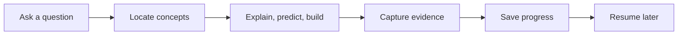

<p align="center">
  
</p>

<div align="center">

# Learning Coach

**Turn scattered AI conversations into a personal knowledge tree that remembers what you have mastered, reveals what is missing, and guides the next useful step.**

English | [简体中文](README.zh-CN.md)

[](LICENSE)
[](https://github.com/SShending/learning-coach/issues/15)
[](skills/learning-coach/references/vault-format.md)

</div>

---

## Learn beyond the current chat

Most AI tutors answer the question in front of them. When the chat ends, your learning state disappears.

Learning Coach turns explanations, mistakes, reviews, and practice into a durable learning map. It resumes from evidence, not from a vague claim that you "understand."

## Learning Loop



Learning Coach saves only durable learning changes, not every conversation.

# Usage

Learning Coach is a portable Agent Skill that helps AI assistants maintain a long-term learning process through a GitHub-based Learning Vault.

```text
Learning Coach Skill
        |
        v
GitHub Learning Vault
        |
        v
Persistent learning memory
```

The Skill defines the learning workflow. The Vault stores your durable learning progress. The host agent provides the capabilities required to run the workflow.

## Recommended: ChatGPT Project

The easiest way to use Learning Coach is with a ChatGPT Project.

### Setup

1. Create a new ChatGPT Project.
2. Add Learning Coach instructions.
3. Upload:

```text
skills/learning-coach/
```

4. Connect a private GitHub repository as your Learning Vault.

See [ChatGPT Project Setup](docs/chatgpt-project.md) for detailed instructions.

### Start learning

```text
Use Learning Coach.

Initialize my Learning Vault.

My goal:
Understand Agent Memory deeply enough to implement a minimal memory-enabled agent.
```

### Continue learning

```text
Continue my learning.
```

or:

```text
Resume agent-memory.
```

Learning Coach restores your learning state and continues from the next useful step.

## Skill-enabled Agents

If your agent environment supports Skills:

1. Load Learning Coach as a Skill.
2. Provide access to your Learning Vault.
3. Use:

```text
Use Learning Coach.
```

The same workflow can be used by different agent environments.

## Learning Vault

Create a private GitHub repository:

```text
learning-vault
```

Learning state is stored in:

```text
.learning-vault/
└── vault.json
```

The Vault stores durable learning progress, including:

- learning goals
- concepts
- mastery evidence
- review history
- next steps

Raw conversations and sensitive information are not saved.

## Prompt Templates

Start a new learning path:

```text
Use Learning Coach.

My learning goal:
<what I want to learn>

My desired outcome:
<what I want to achieve>

Current level:
<my current understanding>

Create or resume my learning path from the Learning Vault.
```

Continue learning:

```text
Use Learning Coach.

Resume my learning path for:
<topic>

Review my progress and choose the next useful step.
```

Update progress:

```text
Use Learning Coach.

I completed:
<implementation / experiment / explanation>

Evaluate my understanding from evidence and update my Learning Vault if this represents durable progress.
```

## Companion Skills

Learning Coach can be extended with skills that maintain and improve the Learning Vault.

### Vault Curator

Vault Curator helps maintain a healthy knowledge base by:

- merging duplicated concepts
- organizing topics
- detecting outdated information
- improving knowledge structure
- preparing review summaries

Run Vault Curator periodically after significant learning progress.

---

## Development

This repository is primarily a skill package. The Skill definition is located at:

```text
skills/learning-coach/
```

## License

Copyright 2026 SShending.

Licensed under the [Apache License 2.0](LICENSE).
