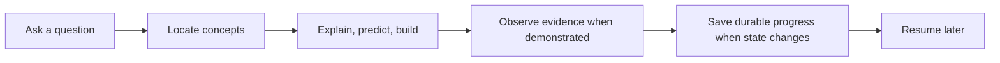

<p align="center">
  
</p>

<div align="center">

# Learning Coach

**Turn scattered AI conversations into a personal knowledge tree that remembers what you have mastered, reveals what is missing, and guides the next useful step.**

English | [简体中文](README.zh-CN.md)

[](LICENSE)
[](https://github.com/SShending/learning-coach/issues/15)
[](skills/learning-coach/references/vault-format.md)

</div>

---

## Learn beyond the current chat

Most AI tutors answer the question in front of them. When the chat ends, your learning state disappears.

Learning Coach turns explanations, mistakes, reviews, and practice into a durable learning map. It resumes from evidence, not from a vague claim that you "understand."

## Learning Loop



Learning Coach does not force assessment after every explanation and does not save every conversation. It persists durable learning changes when they occur.

## Topic Model

Each long-running Topic keeps distinct layers of learning state:

```text
Topic
├── Goal                  why this matters
├── Target Capability     the observable destination
├── Roadmap               adaptive capability milestones
├── Concepts              the knowledge structure
├── Current Focus         what is being learned now
├── Evidence / Mastery    what has actually been demonstrated
├── Gaps / Unassessed     what is known to be difficult or still unknown
├── Notes                 durable understanding worth rereading
└── Next Step             the next concrete action
```

The roadmap provides medium-term direction between the Topic goal and the next action. It is capability-based, evidence-driven, and adaptive rather than a fixed course syllabus. Learning Coach can revise the path when evidence, gaps, or the learner's goal changes, and useful exploration is still allowed outside the roadmap.

## Three Skills, One Vault

The repository separates learning, presentation, and maintenance:

```text
                         Learning Vault
                              |
              +---------------+---------------+
              |               |               |
              v               v               v
       Learning Coach    Learning View     Vault Curator
       learn / assess    present / inspect maintain / repair
       read + write      read-only         read or write
```

- **Learning Coach** changes learner state because learning happened.
- **Learning View** shows existing learner state without changing it.
- **Vault Curator** maintains, repairs, and restructures the Vault when requested.

This keeps presentation logic out of the core learning workflow. A learner can ask to see current progress directly in the Agent interface without cloning repositories or opening a standalone dashboard.

# Usage

Learning Coach is a portable Agent Skill system backed by a private GitHub Learning Vault.

## Recommended: ChatGPT Project

The easiest setup is a ChatGPT Project with the skills you want to use.

### Setup

1. Create a new ChatGPT Project.
2. Add your Learning Coach instructions.
3. Upload the skill directories you want:

```text
skills/learning-coach/   required for learning
skills/learning-view/    recommended for read-only progress views
skills/vault-curator/    optional for maintenance and repair
```

4. Connect a private GitHub repository as your Learning Vault.

Learning Coach requires repository read and write access for normal operation. Learning View only requires read access. Vault Curator requires write access only when applying an approved mutation.

See [ChatGPT Project Setup](docs/chatgpt-project.md) for detailed instructions.

### Start learning

```text
Use Learning Coach.

Initialize my Learning Vault.

My goal:
Understand Agent Memory deeply enough to implement a minimal memory-enabled agent.
```

### Continue learning

```text
Resume agent-memory.
```

### View progress

```text
Use Learning View.

Show my current learning state.
```

Or inspect one Topic:

```text
Use Learning View.

Show deepseek-harness.
```

Learning View reads the authoritative Vault and presents the result directly in the current Agent interface. It does not create evidence, change mastery, or write to the Vault.

## Skill-enabled Agents

If your Agent environment supports Skills, load the skill directories appropriate to the workflow and provide the repository access each skill requires. The same private Learning Vault can be used across compatible Agent environments.

## Learning Vault

Create a private GitHub repository:

```text
learning-vault
```

The Vault separates machine-authoritative state from human-readable Topic views:

```text
.learning-vault/
└── vault.json                     authoritative learner state

topics/<topic-id>/
├── README.md                      current human-readable Topic view
├── notes/                         durable understanding worth rereading
└── sessions/                      privacy-minimized learning checkpoints
```

`vault.json` remains the source of truth. Each Topic README is a derived projection so you can open a Topic in GitHub and immediately see its goal, roadmap, current focus, capability summary, gaps, notes, and next step. If a Topic README ever differs from `vault.json`, the JSON state wins and the README should be regenerated.

The Vault stores durable learning progress, including:

- learning goals and target capabilities
- adaptive capability roadmaps
- concepts and mastery evidence
- durable learning notes
- gaps, review state, and next steps

Raw conversations and sensitive information are not saved.

## Prompt Templates

Start or continue learning:

```text
Use Learning Coach.

Resume my learning path for:
<topic>
```

Capture learning already in progress:

```text
Use Learning Coach.

I have already been learning:
<topic>

Help me reconstruct my current learning state from what I have already studied, built, or explained. Distinguish previous exposure from demonstrated mastery, identify what is still unassessed, and continue from the next useful step.
```

Show an overall read-only view:

```text
Use Learning View.

Show my current learning state.
```

Show one Topic or roadmap:

```text
Use Learning View.

Show the roadmap for <topic>.
```

Review Vault health:

```text
Use Vault Curator.

Review my Learning Vault like a codebase. Do not mutate anything yet.
```

## Optional standalone viewer

`workbench.html` remains an optional local prototype for viewing `vault.json`. It is not required for normal use. Agent-native Learning View is the recommended presentation path because it reads the connected Vault directly and does not require cloning both repositories or manually selecting files.

---

## Development

The skill package is organized under:

```text
skills/
├── learning-coach/
├── learning-view/
└── vault-curator/
```

## License

Copyright 2026 SShending.

Licensed under the [Apache License 2.0](LICENSE).
