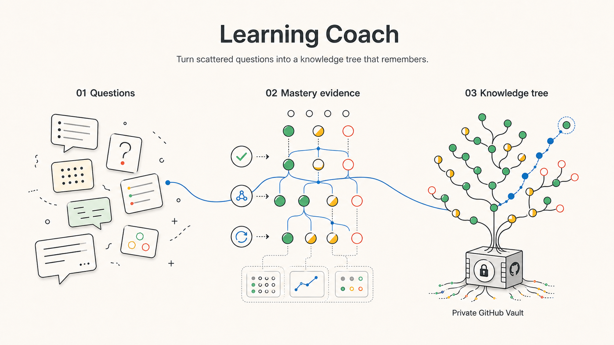
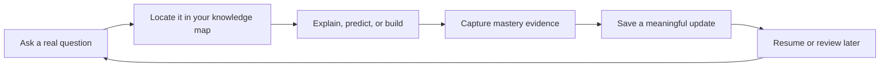

<p align="center">
  
</p>

<div align="center">

# Learning Coach

**Turn scattered AI conversations into a personal knowledge tree that remembers what you have mastered, reveals what is missing, and guides the next useful step.**

English | [简体中文](README.zh-CN.md)

[](LICENSE)
[](https://github.com/SShending/learning-coach/issues/15)
[](skills/learning-coach/references/vault-format.md)
[](#quick-start)

</div>


---

### Learn beyond the current chat

Most AI tutors answer the question in front of them. When the chat ends, your
learning state disappears with it.

Learning Coach turns your questions, explanations, mistakes, reviews, and
working code into a durable personal knowledge map. It resumes from evidence,
not from a vague claim that you "understand."

> Your AI tutor should remember how you learn, not just what you asked.

| What it does | What you gain |
| --- | --- |
| Maps each question to concepts and prerequisites | See the gaps behind the question |
| Tracks mastery from explanations, predictions, and working results | Know what you can actually use |
| Carries focus, evidence, misconceptions, and next steps across chats | Continue instead of restarting |
| Builds a review queue from weak or aging evidence | Revisit the right thing at the right time |
| Stores distilled state in your private GitHub repository | Own, inspect, and version your learning history |

### The learning loop



Learning Coach saves only durable changes. It does not turn every conversation
into a transcript or every answer into a note.

### Quick start

1. Create an empty **private** GitHub repository named `learning-vault`.
2. Connect GitHub to ChatGPT or Codex with repository read and write access.
3. Install Learning Coach from this repository as a supported plugin or skill.
4. Start with a concrete, observable goal:

```text
Help me learn agent memory well enough to build a minimal, testable agent.
```

On the first successful write, Learning Coach creates the Vault state and its
README. In a later chat, ask it to resume the same topic; it will reload your
current focus, gaps, evidence, review needs, and next step.

> **Requirement:** the host must expose GitHub repository read and write tools
> to the same chat. With read-only access, Learning Coach can still teach, but
> it will clearly report that the learning update was not saved.

The default workflow needs no Learning Coach server, tunnel, runtime API key,
private key, local learning folder, or always-on computer.

### Prompts to try

```text
Help me master retrieval-augmented generation well enough to build a small demo.

Resume agent-memory from my Learning Vault and choose the next useful step.

Test the concept I am most likely to forget, then update my mastery from evidence.

Show my current knowledge gaps and explain why each one matters to my goal.
```

### What is saved

| Location | Purpose |
| --- | --- |
| `.learning-vault/vault.json` | Topics, concepts, mastery evidence, review dates, strategy observations, and update history |
| `topics/<topic-id>/notes/` | Concise notes that changed durable understanding |
| `topics/<topic-id>/sessions/` | Privacy-minimized session summaries |
| `public-exports/` | Only material explicitly reviewed as a candidate for sharing |

Raw chat history, hidden reasoning, secrets, broad prompt logs, and unnecessary
personal identifiers are not part of the normal Vault update. See the complete
[Vault format](skills/learning-coach/references/vault-format.md) and
[GitHub operating rules](skills/learning-coach/references/github-operations.md).

### Privacy by default

- Keep the Learning Vault repository private.
- Restrict the GitHub connection to that repository when the host allows it.
- Never save credentials, tokens, private keys, or verification codes.
- Minimize personal and workplace identifiers before writing.
- Treat public export as a reviewed copy, never as a visibility change to the
  private Vault or its history.

### Project status

`main` is the pragmatic alpha: the skill uses GitHub tools already provided by
the host. The earlier dedicated Learning Vault MCP is preserved on
`v3-custom-mcp` and should be reconsidered only when real usage shows that the
generic GitHub path is insufficient. V2 remains on branch `v2` and tag
`v2.0.0`.

- [Pragmatic alpha runbook](docs/private-alpha-runbook.md)
- [Architecture decisions](docs/adr/)
- [Active validation issue](https://github.com/SShending/learning-coach/issues/15)
- [Future dedicated MCP criteria](https://github.com/SShending/learning-coach/issues/16)

---

## Development

This repository is primarily a skill package. Validate changes with the
bundled `skill-creator` and `plugin-creator` validators. The custom MCP runtime
and its Node test suite remain on `v3-custom-mcp`; `main` intentionally has no
runtime dependency on them.

## License

Copyright 2026 SShending.

Licensed under the [Apache License 2.0](LICENSE).
