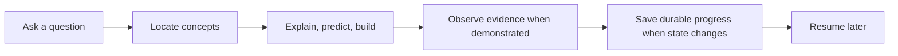

<p align="center">
  
</p>

<div align="center">

# Learning Coach

**Turn scattered AI conversations into a personal knowledge tree that remembers what you have mastered, reveals what is missing, and guides the next useful step.**

English | [简体中文](README.zh-CN.md)

[](LICENSE)
[](https://github.com/SShending/learning-coach/issues/15)
[](skills/learning-coach/references/vault-format.md)

</div>

---

## Learn beyond the current chat

Most AI tutors answer the question in front of them. When the chat ends, your learning state disappears.

Learning Coach turns explanations, mistakes, reviews, and practice into a durable learning map. It resumes from evidence, not from a vague claim that you "understand."

## Learning Loop



Learning Coach does not force assessment after every explanation and does not save every conversation. It persists durable learning changes when they occur.

## Topic Model

Each long-running Topic keeps distinct layers of learning state:

```text
Topic
├── Goal                  why this matters
├── Target Capability     the observable destination
├── Roadmap               adaptive capability milestones
├── Concepts              the knowledge structure
├── Current Focus         what is being learned now
├── Evidence / Mastery    what has actually been demonstrated
├── Gaps / Unassessed     what is known to be difficult or still unknown
├── Notes                 durable understanding worth rereading
└── Next Step             the next concrete action
```

The roadmap provides medium-term direction between the Topic goal and the next action. It is capability-based, evidence-driven, and adaptive rather than a fixed course syllabus.

## Four Skills, One Vault

The repository separates learning, presentation, advisory decisions, and maintenance:

```text
                           Learning Vault
                                |
          +---------------------+---------------------+
          |                     |                     |
          v                     v                     v
   Learning View           Ask Coach             Vault Curator
   present / inspect       advise / prioritize   maintain / repair
   read-only               read-only             read or write
          \                     |                    /
           \                    |                   /
            +-------------------+------------------+
                                |
                                v
                         Learning Coach
                         learn / assess
                         read + write
```

- **Learning Coach** teaches, practices, assesses, and changes learner state because learning happened.
- **Learning View** shows existing learner state without changing it.
- **Ask Coach** recommends what to learn, review, practice, connect, defer, or explore next without changing learner state.
- **Vault Curator** maintains, repairs, restructures, and migrates the Vault when requested.

Ask Coach adds the missing cross-Topic decision layer: it can prioritize today's learning, estimate qualitative review urgency, identify bottlenecks and cross-Topic transfer opportunities, and recommend whether a new Topic is worth opening.

# Usage

Learning Coach is a portable Agent Skill system backed by a private GitHub Learning Vault.

## Recommended: ChatGPT Project

### Setup

1. Create a new ChatGPT Project.
2. Add your Learning Coach instructions.
3. Upload the skill directories you want:

```text
skills/learning-coach/   required for learning
skills/learning-view/    recommended for read-only progress views
skills/ask-coach/        recommended for learning advice and prioritization
skills/vault-curator/    optional for maintenance and repair
```

4. Connect a private GitHub repository as your Learning Vault.

Learning Coach requires repository read and write access for normal operation. Learning View and Ask Coach only require read access. Vault Curator requires write access only when applying an approved mutation.

See [ChatGPT Project Setup](docs/chatgpt-project.md) for detailed instructions.

### Start or continue learning

```text
Use Learning Coach.

Resume agent-memory.
```

### View progress

```text
Use Learning View.

Show my current learning state.
```

### Ask what to do next

```text
Use Ask Coach.

I have 45 minutes today. What should I learn or review, what should I defer, and is there any new Topic worth opening now?
```

Ask Coach is read-only. A recommendation does not create evidence, change mastery, update roadmap/current focus/next step, or create a Topic. If you accept the recommendation and want to begin, switch to Learning Coach.

Typical Ask Coach questions include:

- What should I learn today?
- What should I review before I forget it?
- What should I practice instead of reading more?
- Which Topic is currently my highest-leverage bottleneck?
- How are my Topics connected?
- What knowledge islands do I have?
- What should I deprioritize?
- What new Topic should I learn next?
- Should I open a new Topic at all right now?
- Give me a weekly learning review and plan.

Review recommendations use qualitative **review urgency** from observable Vault signals. The current schema does not pretend to contain calibrated FSRS-style memory stability or recall probability.

## Skill-enabled Agents

If your Agent environment supports Skills, load the skill directories appropriate to the workflow and provide the repository access each skill requires. The same private Learning Vault can be used across compatible Agent environments.

## Learning Vault

The current schemaVersion 2 Vault partitions authority by mutation domain:

```text
.learning-vault/
├── vault.json                     authoritative Vault manifest
├── learning-strategy.json         authoritative cross-Topic strategy
└── migrations/                    migration audit material

topics/<topic-id>/
├── state.json                     authoritative Topic learner state
├── README.md                      current human-readable Topic view
├── notes/                         durable understanding worth rereading
└── sessions/                      privacy-minimized learning checkpoints
```

The Learning Vault is authoritative as a set of domain-owned documents. `vault.json` owns Vault membership and bindings; each manifest-bound `topics/<topic-id>/state.json` owns that Topic's goal, roadmap, Concepts, evidence, mastery, gaps, current focus, linked notes/sessions, and next action. Topic README files are derived projections and never override the bound Topic state.

V2 reduces write amplification and concurrency conflicts: ordinary learning on one Topic replaces only that Topic's `state.json`, rather than rewriting every Topic in one global JSON document. Existing V1 Vaults remain supported until explicitly migrated.

Ask Coach does not add new authoritative fields to V2. Priority, review urgency, cross-Topic connections, bottleneck hypotheses, and new-Topic recommendations are derived advisory computations unless a future explicit schema introduces justified durable state.

See [Vault Format](skills/learning-coach/references/vault-format.md), [Ask Coach Advisory Model](skills/ask-coach/references/advisory-model.md), [GitHub Operations](skills/learning-coach/references/github-operations.md), and [ADR 0016](docs/adr/0016-activate-sharded-learning-vault-schema-v2.md).

## Prompt Templates

Start or continue learning:

```text
Use Learning Coach.

Resume my learning path for:
<topic>
```

Show an overall read-only view:

```text
Use Learning View.

Show my current learning state.
```

Ask for learning advice:

```text
Use Ask Coach.

Based on my current Learning Vault, tell me what to learn, review, practice, connect, defer, or explore next.
```

Review Vault health:

```text
Use Vault Curator.

Review my Learning Vault like a codebase. Do not mutate anything yet.
```

## Optional standalone viewer

`workbench.html` remains an optional local prototype. Agent-native Learning View is the recommended presentation path because it resolves the connected Vault's schema and authoritative Topic state directly.

---

## Development

The skill package is organized under:

```text
skills/
├── learning-coach/
├── learning-view/
├── ask-coach/
└── vault-curator/
```

V1 and V2 schemas are retained separately under `skills/learning-coach/references/schemas/`; the top-level `vault.schema.json` dispatches validation to the appropriate document schema.

## License

Copyright 2026 SShending.

Licensed under the [Apache License 2.0](LICENSE).
