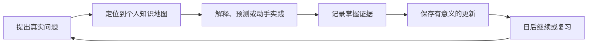

<div align="center">

# Learning Coach

**把零散的 AI 对话变成一棵会持续生长、主动查漏补缺，并用实践证明掌握程度的个人知识树。**

[English](README.md) | 简体中文

[](LICENSE)
[](https://github.com/SShending/learning-coach/issues/15)
[](skills/learning-coach/references/vault-format.md)
[](#快速开始)

</div>

---

### 让学习不再随对话结束

大多数 AI 学习工具只会回答眼前的问题。对话结束后，你学到了什么、误解了什么、
下一步该做什么，也随之消失。

Learning Coach 把你的问题、解释、错误、复习结果和可运行代码，逐渐组织成一张
属于你的知识地图。它依据真实的掌握证据继续教学，而不是仅凭一句“我懂了”。

> 让 AI 不只记得你问过什么，还记得你真正学会了什么。

| 它会做什么 | 你会得到什么 |
| --- | --- |
| 把问题定位到知识点及其前置概念 | 看见问题背后的知识缺口 |
| 根据解释、预测、实践结果评估掌握程度 | 知道哪些知识真的会用 |
| 跨对话保存重点、误区、证据与下一步 | 不必每次重新开始 |
| 根据薄弱或过期证据生成复习队列 | 在合适的时候复习合适的内容 |
| 将精炼后的学习状态保存到私人 GitHub 仓库 | 自己拥有、检查并追踪学习历史 |

### 学习闭环



Learning Coach 只保存真正改变长期学习状态的内容，不会把每段聊天都变成逐字记录，
也不会为了增加笔记数量而保存无意义的总结。

### 快速开始

1. 创建一个名为 `learning-vault` 的空白 **private** GitHub 仓库。
2. 在 ChatGPT 或 Codex 中连接 GitHub，并授予仓库内容的读取和写入能力。
3. 从本仓库安装 Learning Coach 插件或 Skill。
4. 用一个具体、可验证的目标开始：

```text
我想学会 agent memory，并最终独立实现一个最小、可测试的 agent。
```

第一次成功写入时，Learning Coach 会初始化 Vault 状态和说明文件。之后打开新的
Chat，只需让它继续同一主题，它便会读取当前重点、知识缺口、掌握证据、复习需求
和下一步行动。

> **必要条件：** ChatGPT 或 Codex 必须在同一个对话中提供 GitHub 仓库读写工具。
> 如果只有读取权限，Learning Coach 仍可继续教学，但会明确说明本次进展没有保存。

默认方案不需要专用 Learning Coach 服务器、tunnel、runtime API key、私钥、
本地学习文件夹或持续在线的电脑。

### 可以这样使用

```text
帮我系统掌握 RAG，最终做出一个可以运行的小项目。

从 Learning Vault 继续 agent-memory，并选择当前最值得做的下一步。

测试我最容易忘记的知识点，再根据表现更新掌握程度。

展示我当前的知识缺口，并说明它们为什么会阻碍最终目标。
```

### 保存哪些内容

| 位置 | 用途 |
| --- | --- |
| `.learning-vault/vault.json` | 学习主题、知识点、掌握证据、复习日期、学习策略观察和更新历史 |
| `topics/<topic-id>/notes/` | 真正改变长期理解的精炼笔记 |
| `topics/<topic-id>/sessions/` | 经过隐私最小化的学习小结 |
| `public-exports/` | 只有经过明确检查、准备分享的候选内容 |

正常更新不会保存原始聊天记录、隐藏推理、密钥、大量提示词日志或不必要的个人信息。
完整规则见 [Vault 格式](skills/learning-coach/references/vault-format.md) 和
[GitHub 操作规范](skills/learning-coach/references/github-operations.md)。

### 隐私优先

- Learning Vault 应保持为 private 仓库。
- 如果平台支持仓库范围授权，只允许访问选定的 Vault。
- 不保存密码、Token、私钥或验证码。
- 写入前尽量抽象个人和工作场景中的可识别信息。
- 对外发布只生成经过检查的副本，不改变私人 Vault 的可见性，也不公开其历史。

### 当前状态

`main` 是当前务实版 alpha：直接使用宿主提供的 GitHub 工具。早期专用
Learning Vault MCP 完整保留在 `v3-custom-mcp` 分支，只有真实使用证明通用
GitHub 路径无法满足需求时，才值得重新启用。V2 保留在 `v2` 分支和 `v2.0.0`
标签。

- [务实版 Alpha 操作指南](docs/private-alpha-runbook.md)
- [架构决策记录](docs/adr/)
- [当前验证任务](https://github.com/SShending/learning-coach/issues/15)
- [未来专用 MCP 的启用条件](https://github.com/SShending/learning-coach/issues/16)

---

## 开发

本仓库当前主要发布 Skill 包。修改后应使用 `skill-creator` 与 `plugin-creator`
提供的校验工具进行验证。专用 MCP runtime 及其 Node 测试保留在
`v3-custom-mcp`，`main` 不依赖这些运行时组件。

## 许可证

Copyright 2026 SShending.

本项目采用 [Apache License 2.0](LICENSE) 许可。
